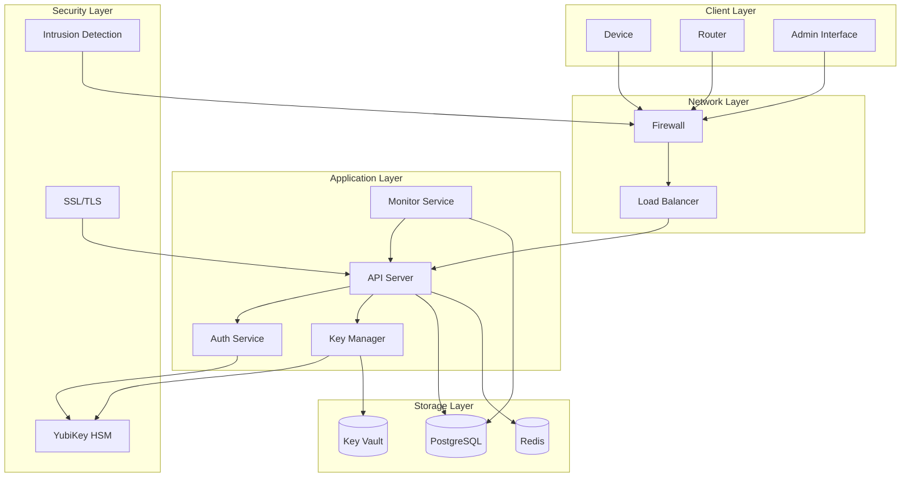
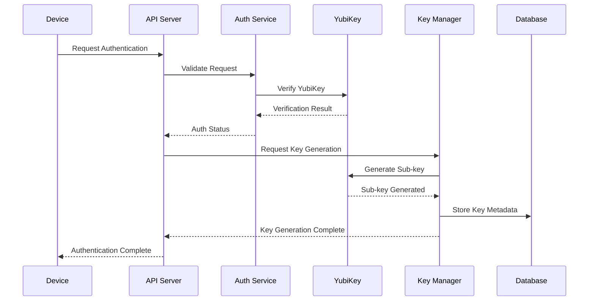
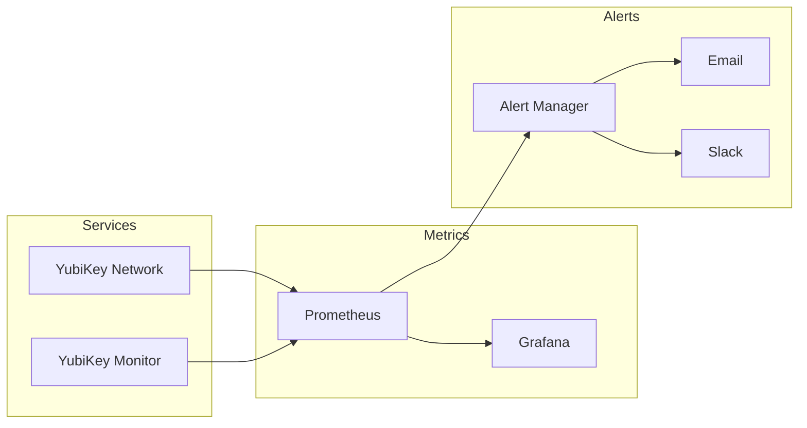
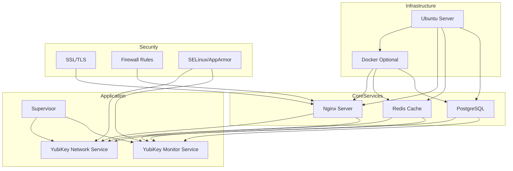
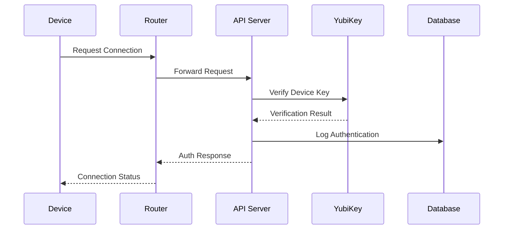
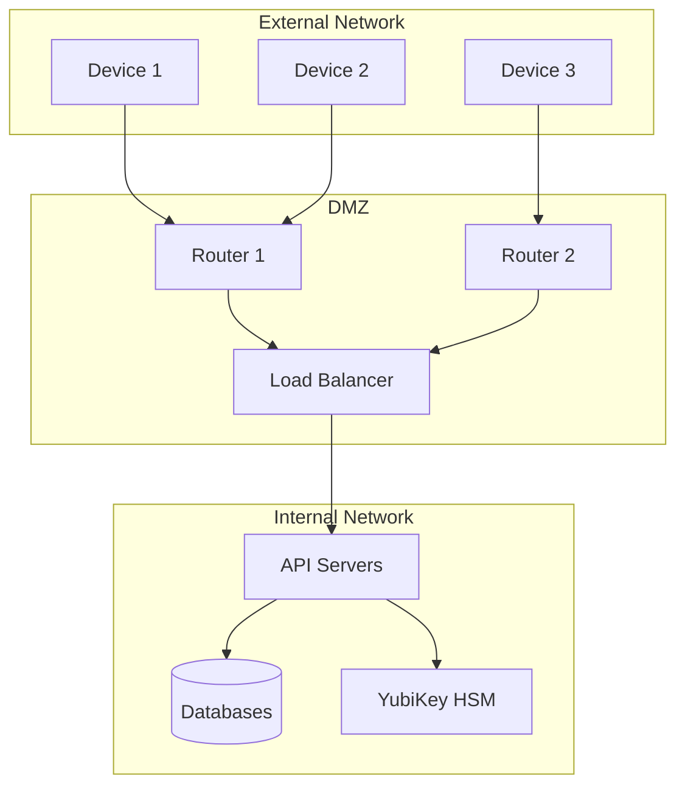
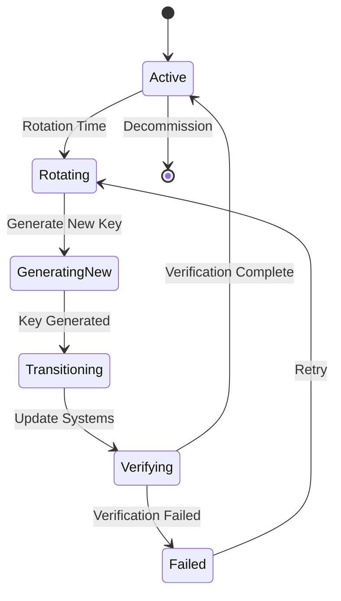

# System Architecture Diagrams

## High-Level Architecture

## Key Management Flow

## Monitoring Architecture

## Backup and Recovery Flow

```mermaid
graph TD
    subgraph Backup Process
        B1[Initiate Backup]
        B2[Export Keys]
        B3[Backup Config]
        B4[Backup Database]
        B5[Create Archive]
        B6[Encrypt Backup]
    end

    subgraph Recovery Process
        R1[Decrypt Backup]
        R2[Extract Archive]
        R3[Restore Keys]
        R4[Restore Config]
        R5[Restore Database]
    end

    B1 --> B2
    B2 --> B3
    B3 --> B4
    B4 --> B5
    B5 --> B6

    R1 --> R2
    R2 --> R3
    R3 --> R4
    R4 --> R5
```

## Deployment Architecture

## Authentication Flow

## Network Topology

## Key Rotation Process

