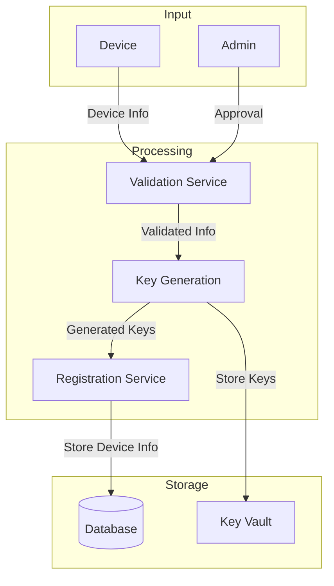
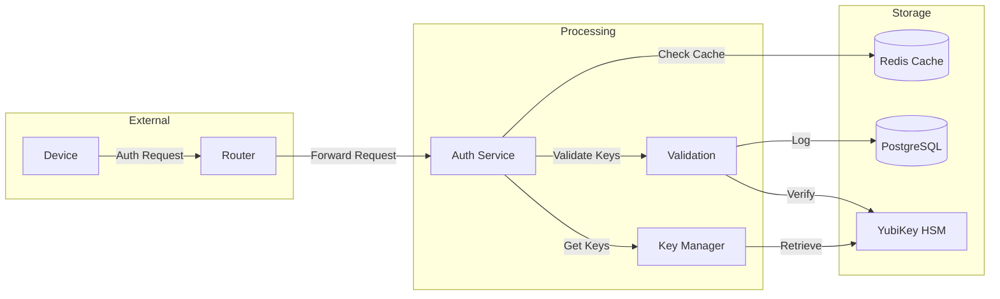
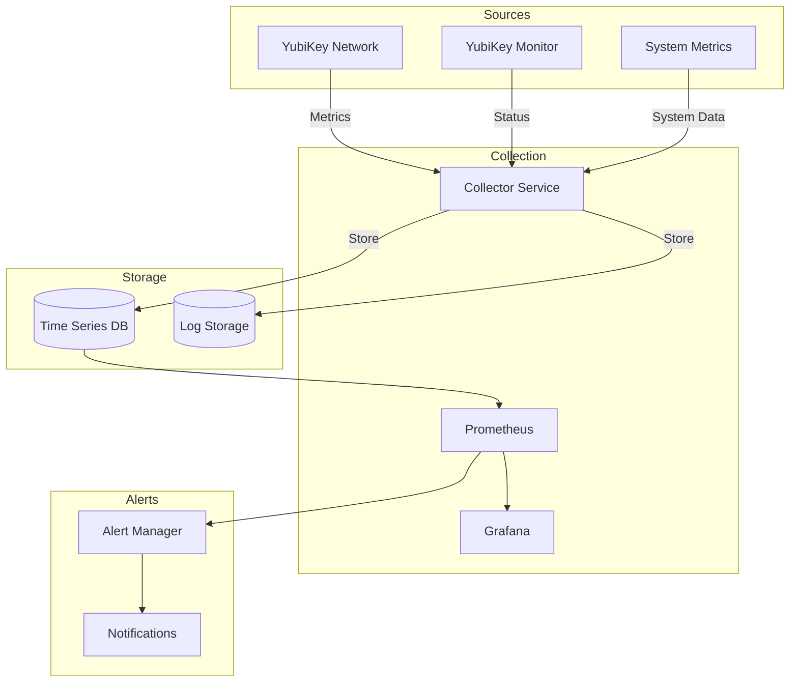
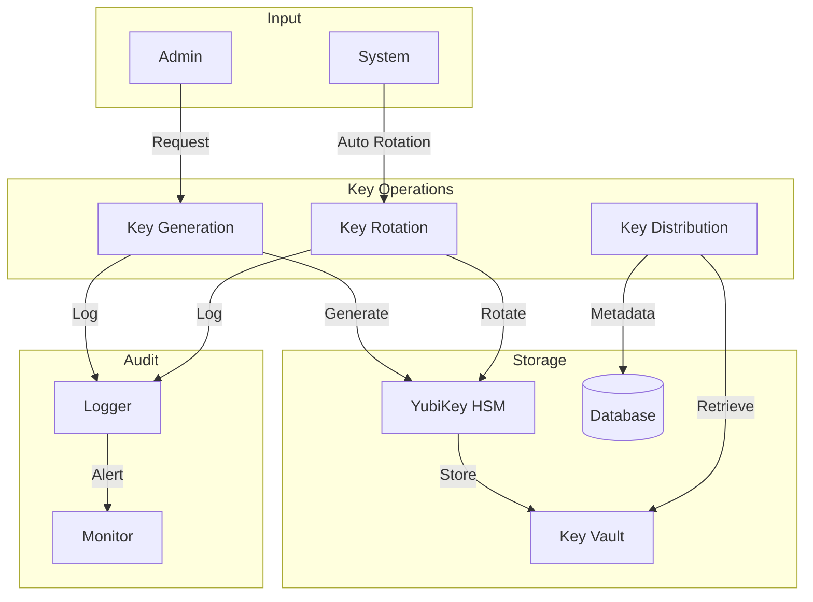
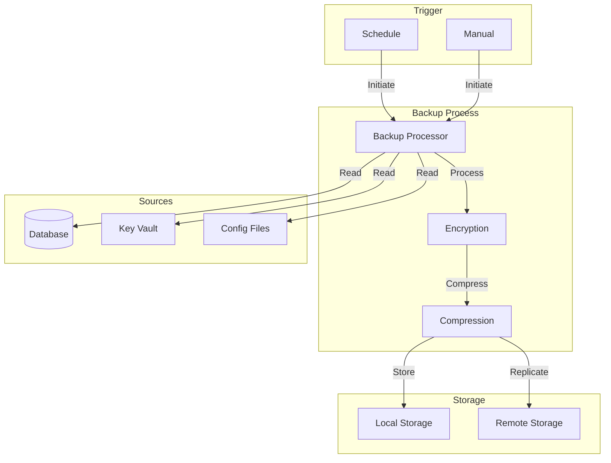
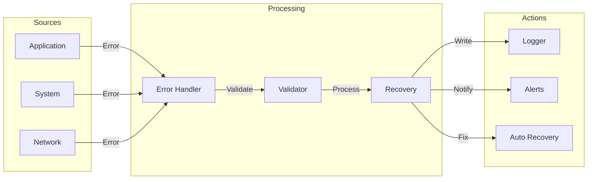
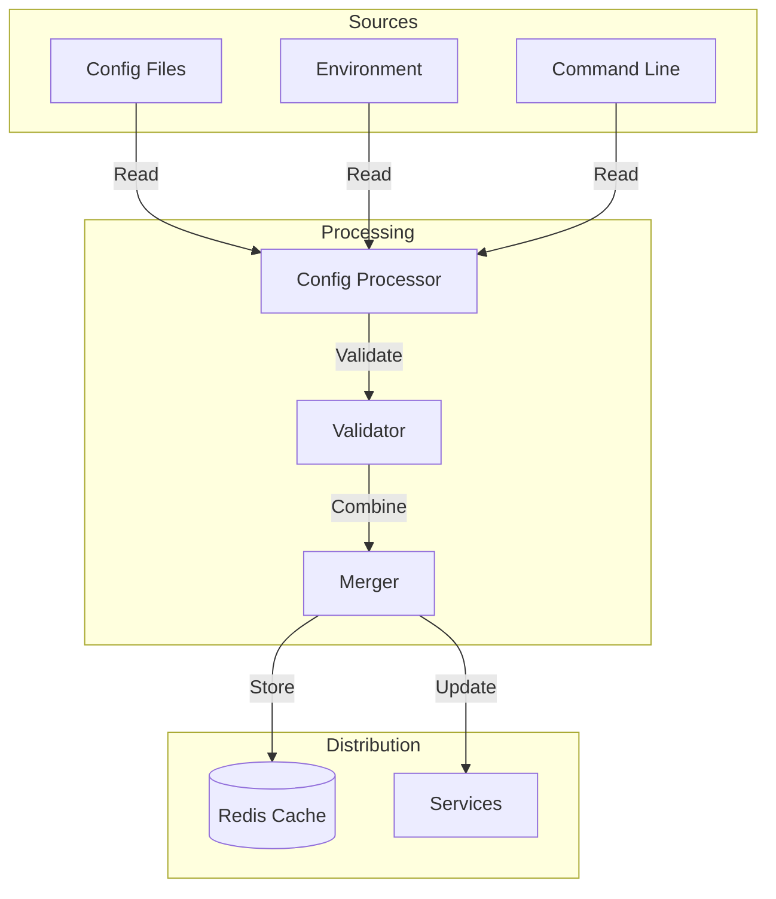
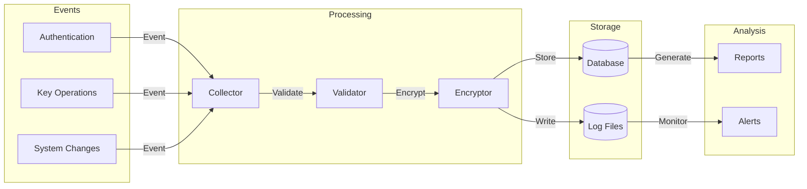

# Data Flow Diagrams

## Device Registration Flow

## Authentication Data Flow

## Monitoring Data Flow

## Key Management Data Flow

## Backup Data Flow

## Error Handling Flow

## Configuration Data Flow

## Audit Trail Flow

