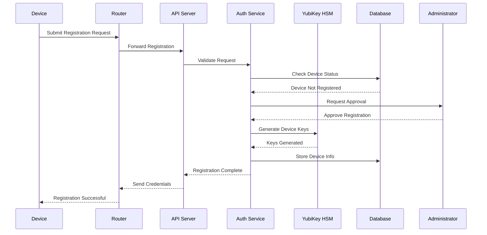
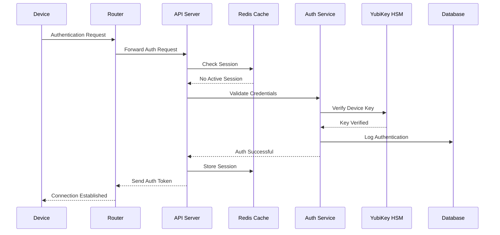
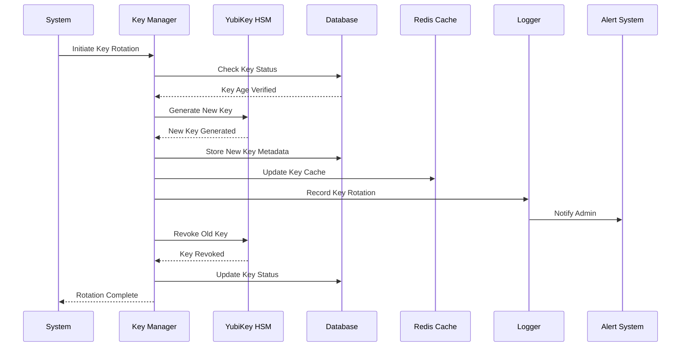
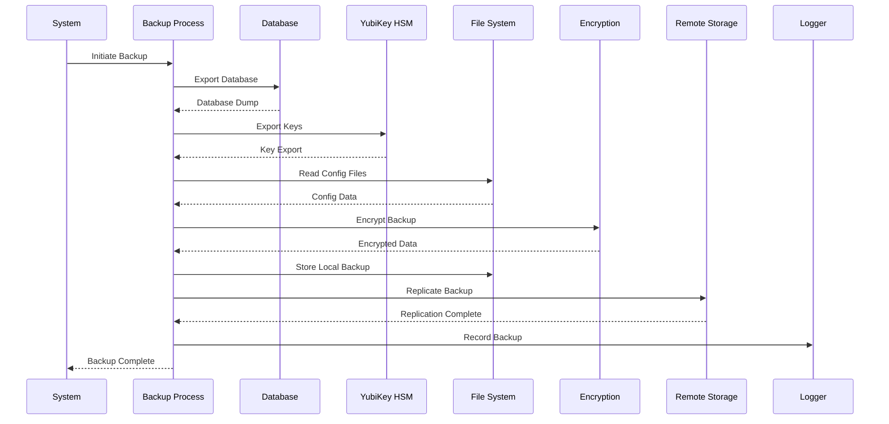
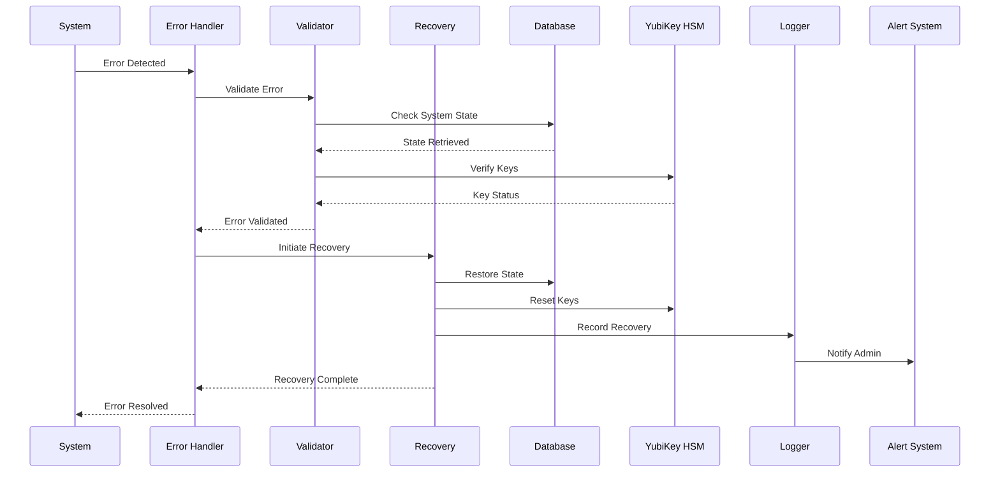
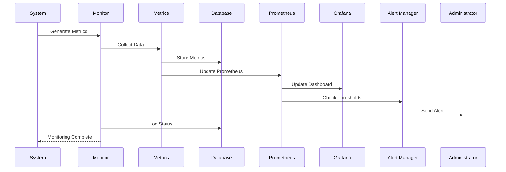
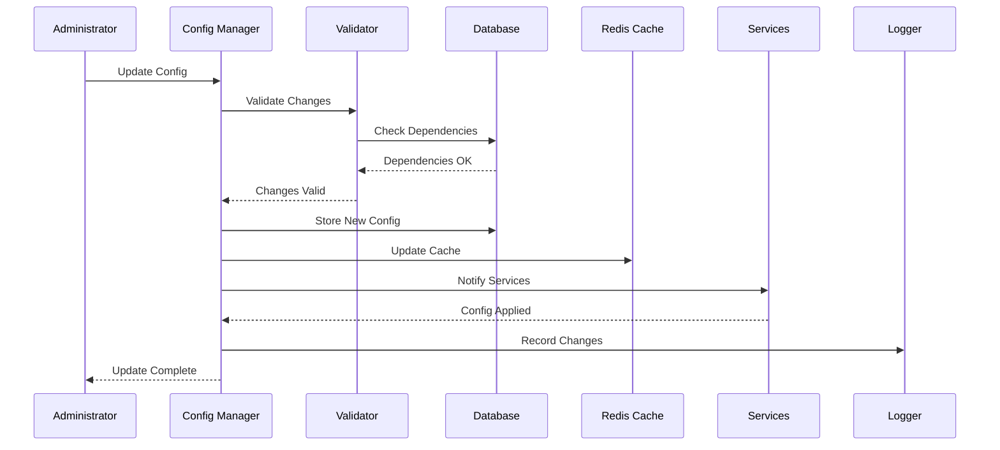
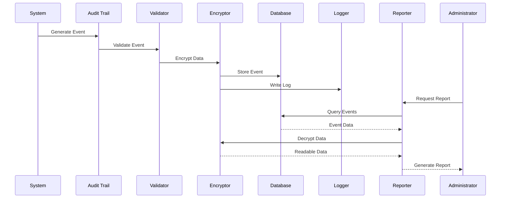

# Sequence Diagrams

## Device Registration Sequence

## Authentication Sequence

## Key Rotation Sequence

## Backup Process Sequence

## Error Recovery Sequence

## Monitoring Sequence

## Configuration Update Sequence

## Audit Trail Sequence

