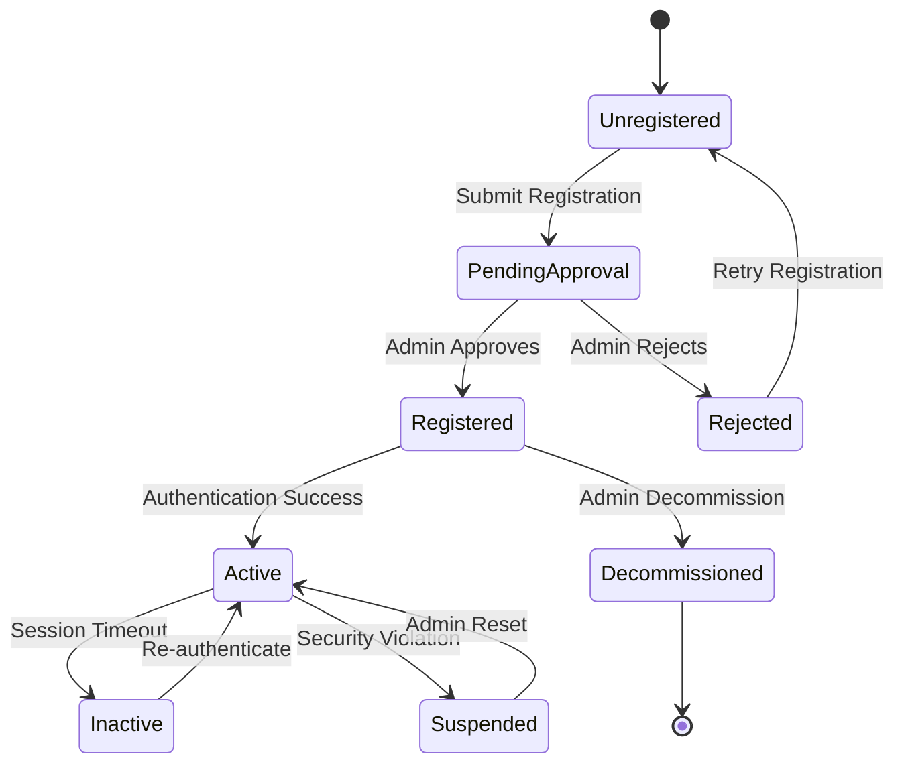
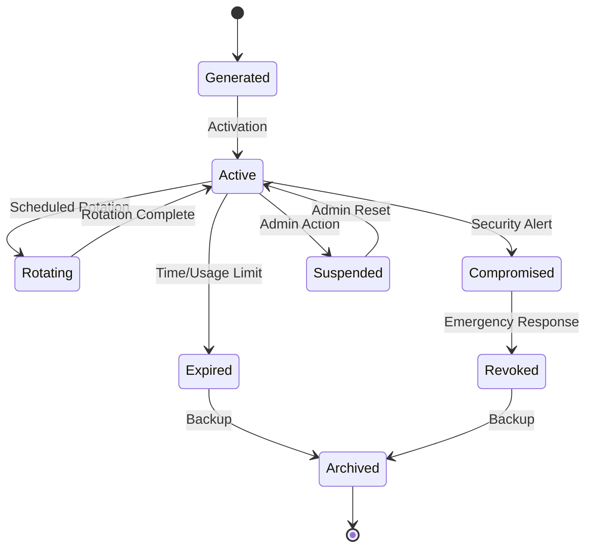
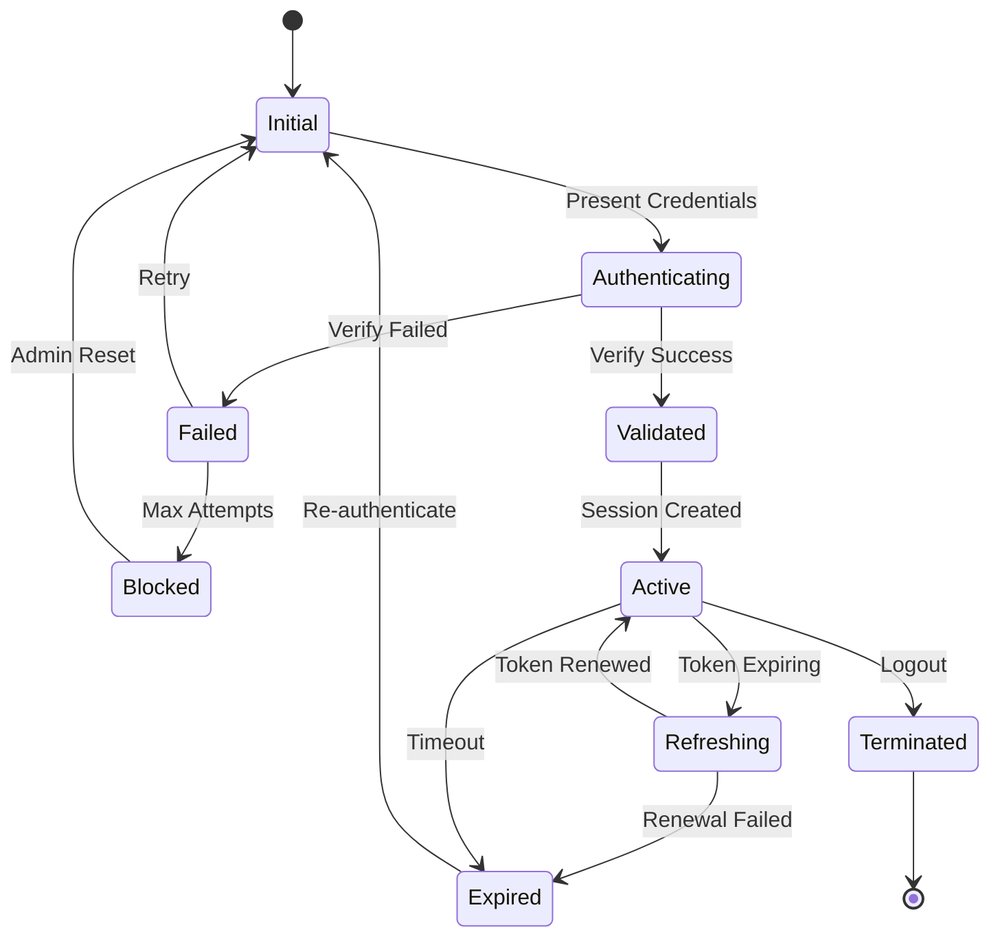
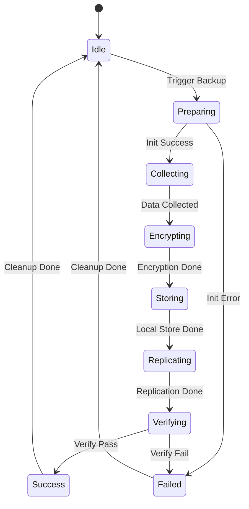
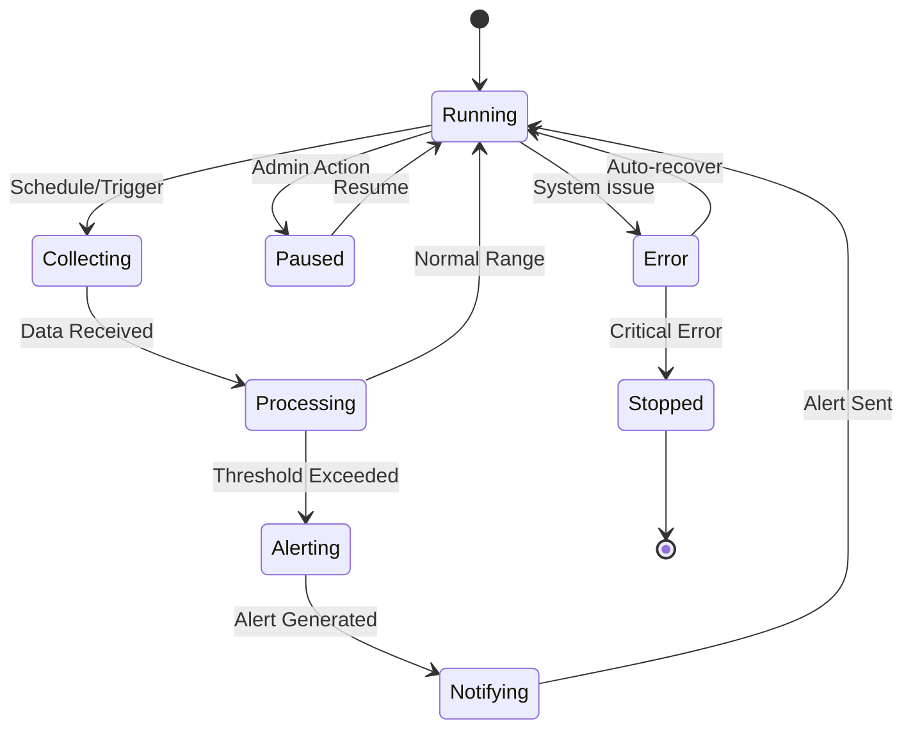
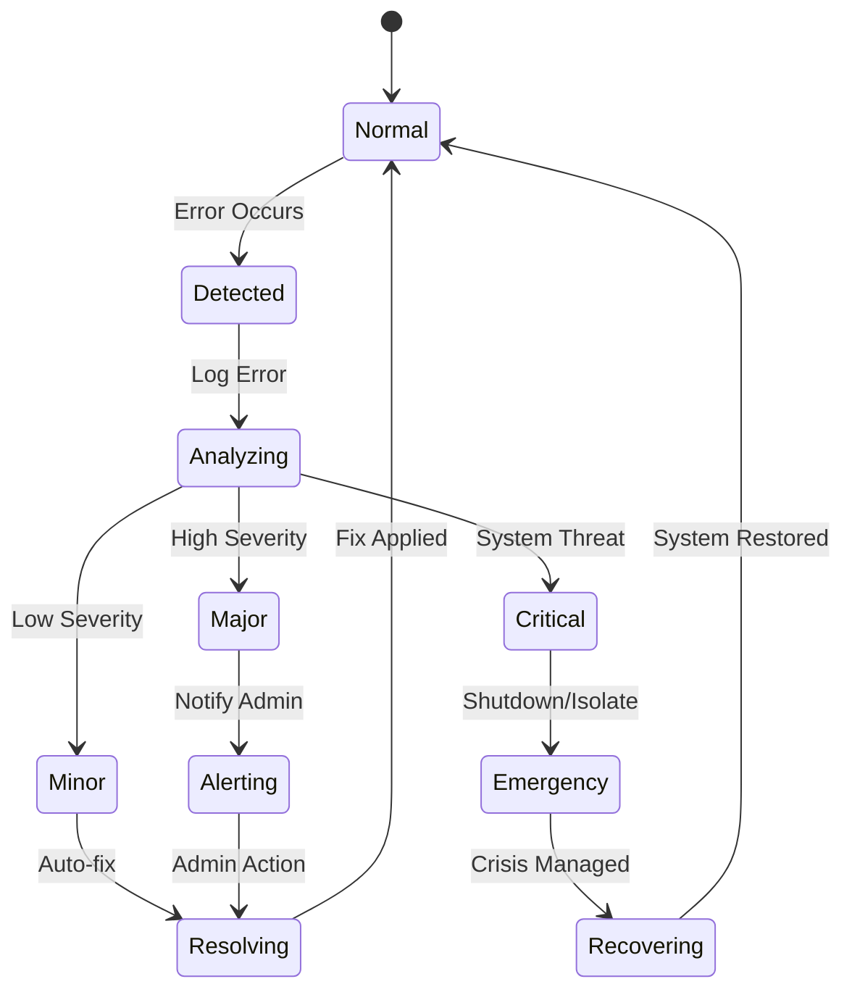
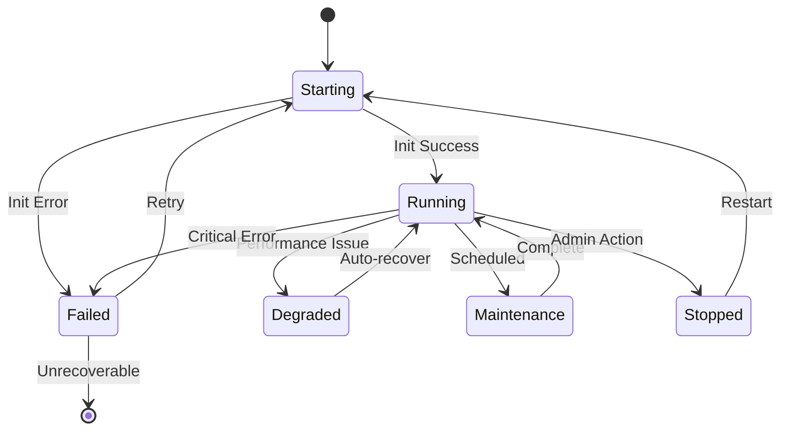

# State Diagrams

## Device States



## Key Lifecycle States



## Authentication Session States



## Backup Process States



## Monitoring System States



## Configuration States

```mermaid
stateDiagram-v2
    [*] --> Default
    Default --> Editing: Admin Modify
    Editing --> Validating: Save Changes
    Validating --> Deploying: Validation Pass
    Validating --> Failed: Validation Error
    Failed --> Editing: Retry
    Deploying --> Active: Deploy Success
    Deploying --> RollingBack: Deploy Error
    RollingBack --> Previous: Rollback Success
    Previous --> Default: Reset
    Active --> Previous: Version Change
```

## Error Handling States



## Service Health States

